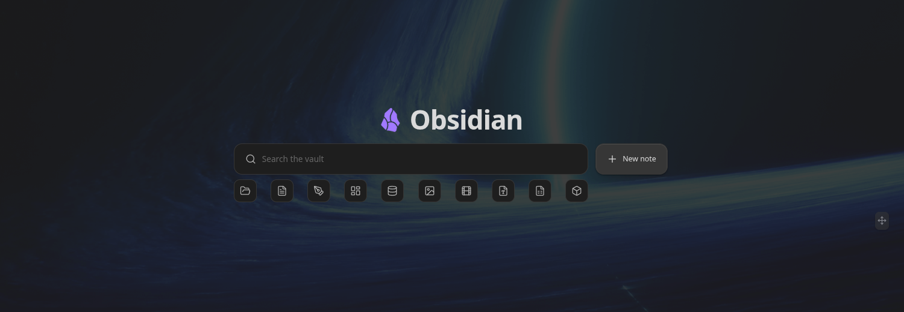
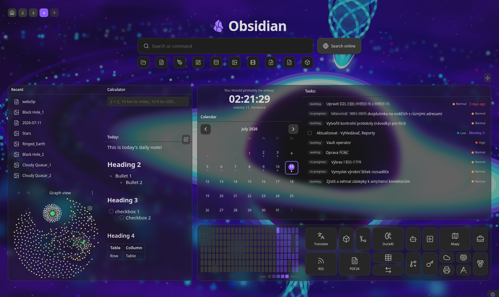
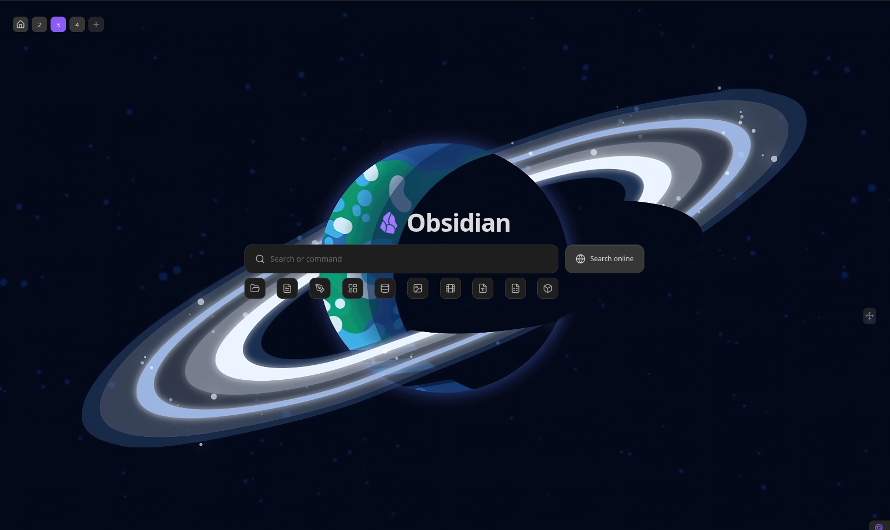
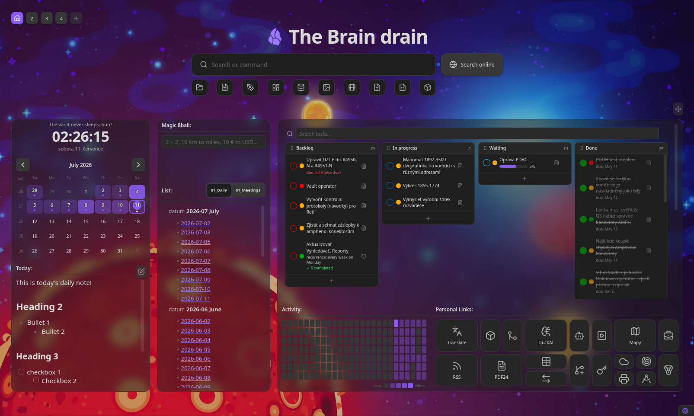
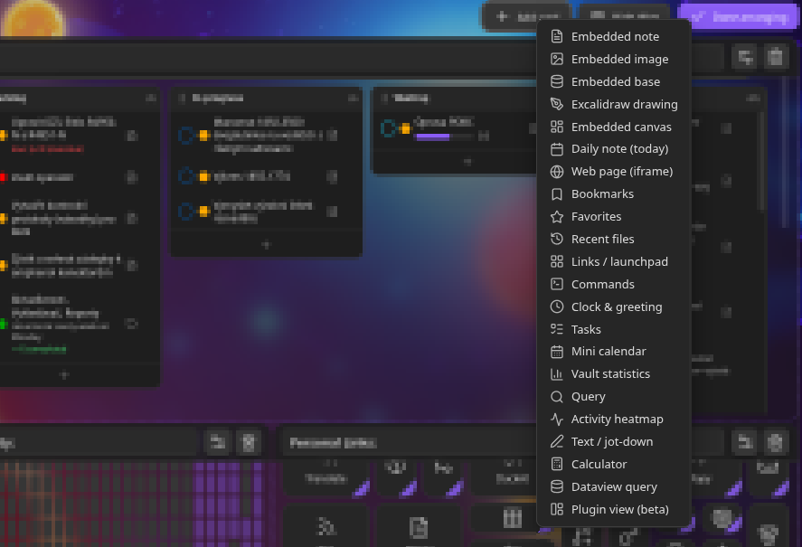
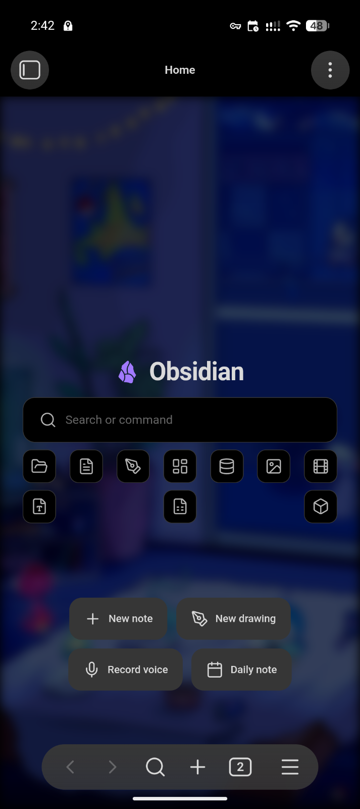

# Hearth — a home screen for Obsidian

[](https://github.com/ondreu/Hearth/actions/workflows/ci.yml)
[](https://github.com/ondreu/Hearth/releases/latest)
[](https://obsidian.md/plugins?id=hearth)
[](LICENSE)



**Hearth turns your Obsidian vault into a welcoming front page.** A fast fuzzy
search bar, quick file-type filters, and a freely arrangeable grid of live
widgets — notes, tasks, kanban boards, calendars, web pages, stats, clocks and
launchers — on desktop and mobile.

Think of it as a new-tab dashboard, start page and command launcher in one.

- 🔍 **Search everything** — fuzzy, full-text, tags, frontmatter and commands
- 🧩 **25+ card types** — embeds, tasks, calendars, Dataview, Git, Jira, and more
- 🎛️ **Free-form layout** — drag, resize and snap cards anywhere
- 🪟 **Frosted glass** — per-card opacity, blur, color and corner radius
- 🗂️ **Multiple dashboards** — switch with a click or a hotkey
- 📱 **Mobile mode** — collapses to a search-only launcher

## Screenshots

| | |
| --- | --- |
|  |  |
|  |  |



## Disclaimer

This plugin was created using AI.

All PR are tested in testing vault by human before merging, and all releases are beta tested in testing vault by human before promoting to stable.

## Quick start

1. Install **Hearth** from Obsidian's community plugin browser — or drop
   `main.js`, `manifest.json` and `styles.css` into
   `<vault>/.obsidian/plugins/hearth/` and enable it.
2. Hearth opens on startup and replaces empty new tabs (both toggleable in
   **Settings → Hearth**).
3. Open it any time from the ribbon **home** icon or the **Open home
   dashboard** command.
4. Hit **Arrange** (top-right) to add, move, resize and configure cards right
   on the board.

## Setup wizard

On a fresh install Hearth offers to build your first dashboard for you. It asks
a handful of questions — a title, a look, what you use your vault for — and lays
out a board from the answers rather than dropping you on a generic starter grid.

It also **looks at what you already have**. Every supported plugin that is
installed and enabled is offered with the one thing accepting it will do:

| Found | What Hearth does with it |
| --- | --- |
| **TaskNotes** | Adds a Tasks card on the TaskNotes source, using TaskNotes' *own* field names and completed statuses |
| **Kanban** | Adds a Tasks card showing your board as draggable columns |
| **Dataview** / **Datacore** | Adds a card, seeded with an editable query |
| **Templater** | Adds a launchpad with a button per template you already have |
| **Git** | Adds a Git card with status, commit and sync |
| **Omnisearch** | Makes it the engine behind Hearth's search bar |
| **Iconic** / **Iconize** | Shows the file icons you already set |
| **Bases** | Embeds a base from your vault |
| **Daily notes** / **Bookmarks** | Adds the matching card |

The TaskNotes case is the one worth calling out: its field names are
user-remappable and its statuses user-defined, so Hearth reads them from the
plugin and copies them across. A vault that renamed `due` to `deadline` gets a
Tasks card that works on its first render.

The last step previews the board — a scale drawing plus a list of every card and
why it's there — before anything is written. Nothing is applied until you press
**Build my dashboard**.

You can run it again any time from **Settings → Hearth → About → Build a
dashboard**, or the **Set up Hearth** command. Run that way it *always* adds a
new dashboard: every board you already have is left exactly as it is.

## Search

The search field is keyboard-first, with four transparent modes:

| Prefix | Mode | Matches |
| --- | --- | --- |
| *(none)* | Fuzzy + full text | File names, tags, properties, and note bodies |
| `#` | Tags | Vault tags, showing which tag matched |
| `key:value` | Frontmatter | Notes whose property matches |
| `>` | Commands | Any registered command, run by name |

- **Auto-detected filters** — file-type chips built from what actually lives in
  your vault (notes, images, video, canvas, bases, Excalidraw…). Click one to
  list its items; hide the ones you don't need.
- **Recent files** appear in an empty, focused search field.
- **New note** button creates a note in your default location.
- **Omnisearch engine** *(optional)* — swap the built-in engine for
  [Omnisearch](https://github.com/scambier/obsidian-omnisearch) under
  **Settings → Appearance → Search engine**.
- **Hide it** — **Settings → Appearance → Home → Show search section** turns
  the whole section off vault-wide, and each dashboard's **Search visibility**
  can follow that default or override it to show or hide the section on that
  board alone.

## Cards

Add cards from the **Arrange** toolbar; configure each one from the card itself
(title, content, colors, size, opacity, blur).

**Add card** opens a searchable picker: type to match a card's name or its
description, or browse by category (Notes & files, Planning, Vault insight,
Tools, Integrations, Fun). Cards backed by a community plugin are always listed
— they're marked *Needs Dataview* (or Datacore, or Templater, or Git) when the plugin isn't
there, with a one-click jump to install it. And if the card you want doesn't
exist, **Request a card** at the bottom of the rail opens a pre-filled GitHub
issue or email.

**Notes & files**

- **Embed** — any note, image, canvas or `.base` file, rendered by Obsidian
  itself. Per-card zoom, optional in-place editing (raw or Live Preview), and a
  second view you can flip to with a switcher. A picture can be framed as well
  as embedded: fill the card and crop, fit the whole thing, stretch it, or fit
  the width and scroll — with the crop anchored to any of nine points, and zoom
  working inside the frame.
- **Slideshow** — pictures from your vault, rotated on a timer. Pick them one by
  one (each with its own caption) or point the card at a folder, with or without
  its subfolders. Order by name, creation or modification date, your own list
  order, or shuffled; choose the seconds per picture, the transition (cut,
  crossfade, slide or zoom) and its length, an optional slow zoom while a picture
  is held, and whether pictures fill the card or fit inside it. Hover for
  previous / pause / next.
- **Daily note** — always today's note, with one-click creation when missing.
- **Excalidraw & canvas** — edge-to-edge templates with native pan/zoom.
- **Plugin view** *(beta)* — host another plugin's side-panel view (calendar,
  outline, tag pane, Kanban…) inside a card, optionally pinned to one file.
- **Dataview** *(requires [Dataview](https://github.com/blacksmithgu/obsidian-dataview))*
  — run a DQL or DataviewJS query and render it through Dataview's own,
  live-updating renderers, with resizable table columns.
- **Datacore** *(requires [Datacore](https://github.com/blacksmithgu/datacore))*
  — the same for Dataview's successor: write a Datacore query and get a live
  list of what it matches, or a full JS/JSX/TS/TSX script rendered by
  Datacore's own views.

**Tasks**

- **Tasks** — reads Markdown checkboxes, TaskNotes task notes, or a
  [Kanban](https://github.com/obsidian-community/obsidian-kanban)
  board note. Toggle, create and open tasks in place; scope by folder.
- **Kanban board** — render any source as a drag-and-drop board with custom
  columns and task states. Drops are written back in Kanban's own format, so
  the note stays editable in the Kanban plugin.
- **Dates & priorities** — full
  [obsidian-tasks](https://github.com/obsidian-tasks-group/obsidian-tasks)
  marks (🔺⏫🔼🔽⏬ 🔁 🛫 ⏳ 📅 ✅), relative labels ("Today", "Next Friday"),
  natural-language input (`📅 in 3 days`), and per-occurrence completion for
  recurring tasks.
- **Sorting & filtering** — smart chain (due → scheduled → priority → created)
  or a custom multi-rule sort, per list and per Kanban column.
- **Custom task fields** *(opt-in)* — build what a task shows from scratch:
  name a field, pick how it's drawn (chip, dot, text, row tint or glow), and
  map any frontmatter or built-in key to labels and colors. Click a value to
  change it.
- **Quick view** — click a task for a compact popover with editable metadata
  and description instead of jumping into the note.

**Time & data**

- **Calendar** — month, week, day and list views over the same sources, with
  named events in the month cells, a scrolling time grid that splits
  overlapping events into columns and marks the current time, and an all-day
  band. Follows your locale's week start and clock by default; the week start,
  hidden weekends, week numbers, drawn hours, hour height and much else are
  yours to set.
- **Mini calendar** — month grid or agenda, resolved from the core Daily notes
  plugin, with dots for existing notes, ISO week numbers and an edit heatmap.
  Subscribe to external **ICS/iCal** calendars, or use **TaskNotes** as a
  source (scheduled tasks, due dates, recurrences, timeblocks). Create a note
  from any event, linked back by ID.
- **Vault statistics** — notes, attachments, folders, tags and daily-note
  streak.
- **Activity heatmap** — a GitHub-style grid of notes edited or created per day.
- **Saved search** — a stored query, refreshed live.
- **Jira filter** — a saved Jira filter over HTTPS with bearer PAT auth, plus
  status / assignee / priority / type / sprint / version filtering. Exports
  never include the PAT.
- **Weather** — current conditions and a forecast from
  [Open-Meteo](https://open-meteo.com), free and with no API key or account.
  Five styles, from a bare glyph and temperature to an edge-to-edge painted sky
  that follows the real conditions and the time of day (drifting clouds, rain,
  snow, stars, lightning). Search for a place or type coordinates, pick your
  units, and switch on exactly what you want to see — feels-like, high/low,
  humidity, wind, precipitation, UV, pressure, sunrise and sunset, an hourly
  strip and a daily forecast.
- **Clock & greeting** — digital or analogue face, custom date formats, and an
  optional playful greeting.
- **Git** *(requires [Git](https://github.com/Vinzent03/obsidian-git))* — your
  vault's repository at a glance: branch, staged and changed files, unpushed
  commits and the recent log, with buttons that commit, sync, push, pull,
  stage and discard. Every one of those is the Git plugin doing the work
  through its own task queue, so your remote, credentials and commit-message
  template apply unchanged — and right-clicking a changed file offers its diff,
  staging and discard. Choose which sections and which buttons the card shows,
  and what a commit from it covers.

**Launchers & utilities**

- **Links / launchpad** — a grid of tiles opening notes, URLs or commands, each
  with its own column and row span, droppable anywhere on the card.
- **Commands** — tiles that run any command-palette command.
- **New note from template** *(requires
  [Templater](https://github.com/SilentVoid13/Templater))* — the same launchpad,
  but each tile makes a note: pick one of your Templater templates, the folder
  the note goes in, and a filename pattern (`Meeting {{date}}`, `{{prompt}}` to
  be asked for the rest of the name), and one click creates it. The same
  template can feed three different folders from three different buttons —
  something Templater's own per-template commands can't do, since they all obey
  one default location. Templater does the templating: your user scripts,
  `tp.system.prompt()` dialogs and `tp.file.cursor()` placement behave exactly
  as they do from its own command. Tiles that only file something away can skip
  opening the note.
- **Bookmarks** — Obsidian's core bookmarks, with site favicons.
- **Favorites** and **Recent files** — curated and recent note grids.
- **Web page** — any `http(s)` URL in a sandboxed iframe, with optional
  auto-refresh.
- **Text / jot-down** — a quick Markdown scratch field saved with the card.
- **Calculator** — evaluates as you type: math, unit conversions, number bases
  (`FF hex to decimal`, `255 to hex`), live currency
  ([Frankfurter](https://www.frankfurter.app/), ECB rates) and plain-language
  queries (`20% of 150`). Optional on-screen keypad.
- **Pet** — a pixel-art companion (cat, dog, bird, fox, frog or blob) whose
  mood follows your vault: content, happy or bouncing with joy as you write,
  slouched and bored and then curled up asleep on a quiet day. Each mood is
  drawn animation — blinking, head-wagging, hopping, breathing — and its eyes
  follow your pointer. Set a night window and a quiet small hour reads as the
  hour, not as neglect. No hunger, no age, nothing to lose — and clicking it
  earns hearts. Name it, color it, and set where every mood begins.

Everything is **live**: embeds and editable notes follow vault events without
losing your cursor, data cards redraw on vault and metadata changes, and web
cards can refresh on a timer. Cards that reach the network (Jira, calendars,
weather, currency) all respect **Settings → Behaviour → Disable external
calls**.

## Layout

- **Free-form drag & resize** — move cards anywhere and resize from any edge or
  corner, with magnetic snapping to neighbours and the board.
- **Edge-merging** — snap two cards together and their shared border drops out,
  so the pair reads as one continuous tile.
- **Multiple dashboards** — a `[1] [2] [+]` switcher in the top-left. Name each
  board, give it an emoji or a Lucide icon, reorder by dragging, and override
  the global width, columns, row height, background and title icon per board.
  Open a board's settings either from **Dashboard settings** in the **Arrange**
  toolbar or by right-clicking its switcher button.
- **Pinned cards** — pin a card to appear on every dashboard, sharing one
  definition and position.
- **Fit to page** — lock the board to one screen or let it scroll.
- **Import / export** — back up or share a board's layout as JSON.

## Appearance

- **Background** — solid color, vault image, URL, or a **live weather sky**:
  the board's backdrop becomes the painted sky the weather card's artistic style
  draws, spread across the whole window and following the real conditions and
  time of day over a place you pick. Or pin one sky — clear night, snow,
  thunder — and keep it whatever the weather is doing, which needs no location
  and never goes online. All with opacity and blur.
  Ships with a soft ambient default.
- **Banner or full background** — wear that same backdrop either way: filling
  the whole view, or as a **banner** across the top of the board — a cover
  image, the way one sits above a note — with the cards below it on your
  theme's own surface. Set the height, fade the lower edge into the page, and
  choose whether it lines up with the content or runs edge to edge. Each of
  those is its own per-board override, so one dashboard can show the vault's
  background as a banner while the next keeps it as a wallpaper — no picture
  restated either way.
- **Frosted glass** — card opacity and backdrop blur at three levels (global →
  per-dashboard → per-card). Merged cards blur as one seamless sheet.
- **Card corner radius** — from the default 14 px down to sharp 0 px.
- **Per-card colors** — an accent and a background tint for any card.
- **Title, logo and compact spacing** for the dashboard header.
- **Lucide icons** — pick any icon from the Lucide set for Hearth's **tab and
  ribbon** button and for the **title** beside the board's heading, searched
  from a picker rather than typed from memory. Each dashboard can override the
  title icon, so one board can show a flame and the next a rocket; leave a field
  empty and the Hearth crystal (or your emoji logo) stays as it was.

## Mobile

- **Mobile mode** — an optional search-only launcher on phones and tablets;
  desktop is unaffected.
- **Action bar** — a row of buttons under the search field (New note, New
  drawing, Record voice, Open daily note by default), each swappable for any
  command.
- **Keyboard-aware** — the visible area tracks the on-screen keyboard.

## Settings

Everything lives under **Settings → Hearth**, grouped by a category ribbon:
**Appearance**, **Search**, **Dashboard**, **Behaviour** (startup, new tabs,
where notes open, mobile, privacy), **Integrations**, **Backup** and **About**.
Per-card settings are edited from the card itself in arrange mode.

## Keyboard shortcuts

Bindable under **Settings → Hotkeys**:

- **Open home dashboard**
- **Switch to dashboard 1…9**
- **Switch to next / previous dashboard**

In the search field: `↑`/`↓` to move, `Enter` to open, `Esc` to dismiss.

## Development

```bash
npm install      # install dependencies
npm run dev      # watch build -> main.js
npm run build    # typecheck + production build
npm run typecheck
```

To test in a vault, symlink or copy `main.js`, `manifest.json` and `styles.css`
into `<vault>/.obsidian/plugins/hearth/`.

**Translations** — user-facing strings live in [`src/locales/`](src/locales/).
English (`en.ts`) is the source of truth; copy it, translate the values and
register the file. See [`src/locales/README.md`](src/locales/README.md).

## Contributing

Hearth moves fast, so the most valuable contributions right now are **bug
reports**, **feature ideas** and **translations**. Small, obvious fixes are
always welcome; for anything larger, please open an issue first — big PRs
against a fast-moving codebase tend to go stale. See
[CONTRIBUTING.md](CONTRIBUTING.md).

## Support

Hearth is free and open source. If it's earned a place on your vault's front
page, you can buy me a coffee — it genuinely helps keep the updates coming.

[](https://ko-fi.com/B7K822EW68)

## License

MIT © ondreu · [Changelog](CHANGELOG.md) · [Security](SECURITY.md)
